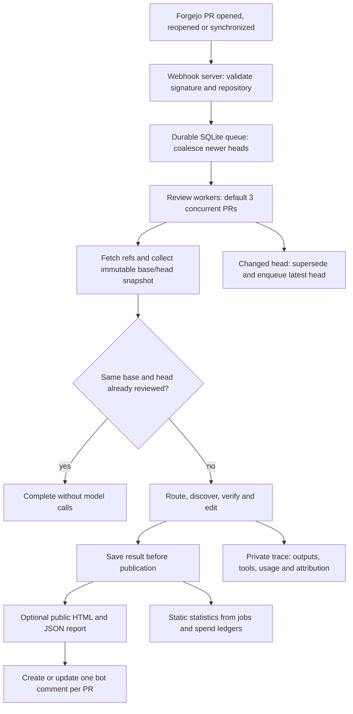
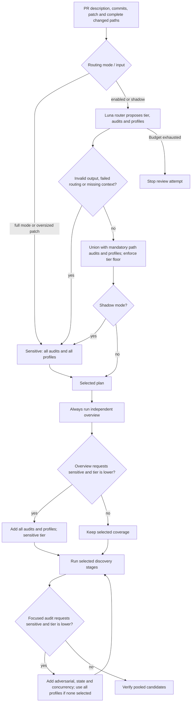
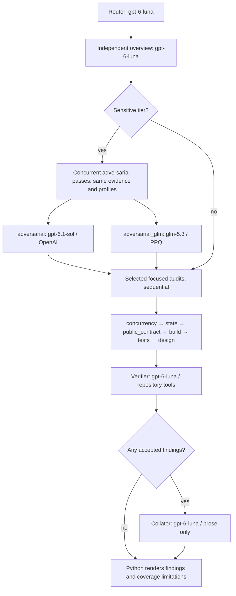
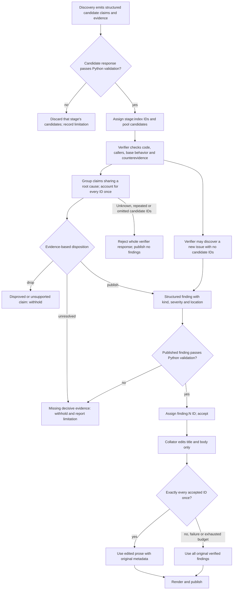

# Forgejo review bot structure

The bot performs static Bitcoin Core PR reviews. It discovers candidate findings
in independent passes, checks them against repository evidence, and publishes
only verified findings. It does not build or execute PR code.

These diagrams describe the checked-in defaults. [models.json](audits/models.json)
assigns models; callers can replace the complete map with `--models-json`.
The [NixOS module documentation](../../modules/forgejo-review-bot/README.md)
covers deployment and options. Mermaid diagrams render in supporting Markdown
viewers; their source remains readable in a plain text editor.

## Service and review lifecycle

Only one attempt runs per PR. Fetch and snapshot preparation share a Git lock;
model calls run outside it. Each attempt pins its Git objects with separate refs.
Head checks prevent stale reviews from being published. Publication retries reuse
saved results rather than paying for another review. Transient transport failures
have bounded job retries. Oversized inputs use a changed-file manifest and diff
tools; if the PR prelude and manifest still exceed 200,000 bytes, review is skipped.

Sources: [service.py](forgejo_review_bot/service.py),
[jobs.py](forgejo_review_bot/jobs.py), [repository.py](forgejo_review_bot/repository.py).

## Audit selection

The router can add coverage but cannot remove path-mandated coverage. A sensitive
tier always adds adversarial review, even when no domain profile is selected.
Profiles extend the adversarial prompt; they are not separate model calls.

| Changed paths, excluding tests where stated | Mandatory coverage / tier floor |
| --- | --- |
| Documentation or tests only | Routine floor; tests audit for test changes |
| Production code, excluding docs, tests and recognized build paths | Standard floor; tests and design audits |
| Consensus, validation, script, chainstate, serialization and related paths | Sensitive; consensus profile |
| Wallet paths | Sensitive; wallet profile |
| Network, policy, mempool and related paths | Sensitive; p2p profile |
| Synchronization, scheduler, queues, validation callbacks, thread utilities | Sensitive; concurrency audit |
| Databases, indexes, wallet storage, chainstate and block storage | Sensitive; state audit |
| RPC, CLI, HTTP, REST, initialization and argument handling | Sensitive; public_contract audit |
| Recognized build paths, including CMake, depends, Guix, CI and Cargo/flake locks | Sensitive; build audit |
| Crypto and secp256k1 paths | Sensitive floor |

These are summaries of the regex rules in [routing.py](forgejo_review_bot/routing.py).
Rules overlap. The router can select any additional audit or profile based on
behavior, including effects that filenames alone do not reveal. Empty audit and
profile lists are valid when no coverage applies. Routine does not mean no review.

## Stages, models and evidence

Skipped audits do not make model calls. Escalation can add pending stages during
discovery. Sol and GLM run concurrently when a PPQ key is supplied; without that
key, the Python pipeline runs Sol alone. The service CLI requires both keys.
Reviewers do not see other discovery passes' candidates. The verifier sees the
pooled candidates and original review input.

| Stage | Default model | Reasoning effort | Per-response output token ceiling | Evidence access |
| --- | --- | --- | --- | --- |
| router | gpt-6-luna | low | 4,000 | Supplied input only |
| independent | gpt-6-luna | low | 4,000 | Full tool set |
| adversarial | gpt-6.1-sol | high | 25,000 | Full tool set and selected domain profiles |
| adversarial_glm | glm-5.3 | high | 25,000 | Same tools and profiles, via PPQ |
| concurrency | gpt-6-luna | medium | 8,000 | Focused input and code tools |
| state, public_contract, build, tests | gpt-6-luna | low | 4,000 | Focused input and code tools |
| design | gpt-6-luna | xhigh | 25,000 | Focused input, code tools and merge-base developer notes |
| verifier, routine/standard | gpt-6-luna | low | 8,000 | Original input, candidates and full tool set |
| verifier, sensitive | gpt-6-luna | high | 25,000 | Original input, candidates and full tool set |
| collator | gpt-6-luna | low | 6,000 | Accepted findings only; no tools |

Code tools find paths, read head/base files, read diffs and search code. The full
tool set also reads base history and other PR discussions. Current PR discussion
is excluded. Frozen evaluations disable discussion access.

Discovery allows 12 tool calls at routine tier, 24 at standard, and 48 at sensitive.
Both adversarial passes and verification allow 48. History and other-discussion
sublimits are eight each per tool-enabled stage. Independent, adversarial and
verifier stages require a first inspection. At limits, a final turn uses collected
evidence and must preserve uncertainty.

OpenAI's default estimated review allowance is USD 1.00; PPQ has a separate
USD 0.50 allowance. Routing and discovery protect OpenAI verifier headroom,
refreshed as candidates accumulate. Admission checks also protect a final model
response after inspection. Budget limits can still prevent completion, including
through competing workers' monthly spending. Failed discovery becomes a coverage
limitation; failed verification publishes no unverified findings. Failed editing
falls back to verified wording.

Sources: [pipeline.py](forgejo_review_bot/pipeline.py),
[model.py](forgejo_review_bot/model.py), [spend.py](forgejo_review_bot/spend.py),
[config.py](forgejo_review_bot/config.py).

## How findings survive or get rejected

Candidate findings are leads, not votes. Agreement between Sol, GLM and focused
reviewers gives a claim no extra weight. A defect needs a reachable trigger and
consequence, checked against the strongest code-based reason it might be false.
Static proof can suffice; running a reproduction is not required.

Design findings need an established premise and material tradeoff. A grounded
question can survive even when the implementation is correct and the author must
supply a requirement or measurement. Uncertainty about the choice differs from
missing evidence for its premise. Suggestions need a concrete present cost and
supported alternative. Generic questions, unsupported alternatives, preferences
presented as bugs, insults and inferred motives should be rejected by the verifier.
These are prompt requirements, not mechanical proof checks.

Python enforces structure, candidate accounting, allowed kinds and severities,
nonempty required text, and locations in changed paths that exist on the specified
head/base side with positive integer lines. The verifier must check the actual
line and claim; Python does not check line bounds or prove factual correctness.
Malformed discovery rejects the entire stage result. A malformed published
finding becomes unresolved while other valid findings survive. Structural or
candidate-accounting errors reject the entire verifier response.

Partial coverage does not discard otherwise valid findings. An unresolved
candidate or failed stage adds a limitation. The collator cannot add, merge or
remove accepted IDs, or change their kind, severity or location. Python enforces
those metadata constraints; preservation of meaning is a prompt requirement.

Rendering groups findings as critical, design and approach, major, minor, then
suggestion, omitting empty sections. Design kind determines its own section.
The comment contains the commit header, verified review and optional report link.
Reports expose stage replies, dispositions and attribution. Statistics distinguish
sole and shared accepted findings; verifier acceptance is not human validation
or a measurement of recall. Profiles within one adversarial call get no separate
causal credit.

Sources: [protocol.py](forgejo_review_bot/protocol.py),
[verifier prompt](audits/verifier.md), [collator prompt](audits/collator.md),
[report.py](forgejo_review_bot/report.py), [stats.py](forgejo_review_bot/stats.py).
